# Markup Syntax Highlighting

Syntax highlighting[^1] is a feature that displays source code.
This feature facilitates writing in a structured language such as a programming language or a markup language as it makes import things visually distinct.


### GFM Code Blocks

GitHub Flavored Markdown [fenced code blocks](https://help.github.com/articles/creating-and-highlighting-code-blocks/) are supported. To modify styling and highlight colors edit `/_sass/syntax.scss`.

```css
#container {
  float: left;
  margin: 0 -240px 0 0;
  width: 100%;
}
```


.highlight {
  margin: 0;
  padding: 1em;
  font-family: $monospace;
  font-size: $type-size-7;
  line-height: 1.8;
}


```html
<nav class="pagination" role="navigation">
  
    <a href="{{ site.url }}{{ page.previous.url }}" class="btn" title="{{ page.previous.title }}">Previous article</a>
  
  
    <a href="{{ site.url }}{{ page.next.url }}" class="btn" title="{{ page.next.title }}">Next article</a>
  
</nav><!-- /.pagination -->
```

```ruby
module Jekyll
  class TagIndex < Page
    def initialize(site, base, dir, tag)
      @site = site
      @base = base
      @dir = dir
      @name = 'index.html'
      self.process(@name)
      self.read_yaml(File.join(base, '_layouts'), 'tag_index.html')
      self.data['tag'] = tag
      tag_title_prefix = site.config['tag_title_prefix'] || 'Tagged: '
      tag_title_suffix = site.config['tag_title_suffix'] || '&#8211;'
      self.data['title'] = "#{tag_title_prefix}#{tag}"
      self.data['description'] = "An archive of posts tagged #{tag}."
    end
  end
end
```

### Code Blocks in Lists

Indentation matters. Be sure the indent of the code block aligns with the first non-space character after the list item marker (e.g., `1.`). Usually this will mean indenting 3 spaces instead of 4.

1. Do step 1.
2. Now do this:

   ```ruby
   def print_hi(name)
     puts "Hi, #{name}"
   end
   print_hi('Tom')
   #=> prints 'Hi, Tom' to STDOUT.
   ```

3. Now you can do this.

### GitHub Gist Embed

An example of a Gist embed below:

<script defer src="https://gist.github.com/sylhare/dad7ed1ef3d13614c77c4ebadf8a11c3.js"></script>

Here is how it looks like:



   <script src="https://gist.github.com/sylhare/dad7ed1ef3d13614c77c4ebadf8a11c3.js">
   </script>



<br>

[^1]: 


# Markdown and HTML

Jekyll supports the use of [Markdown](http://daringfireball.net/projects/markdown/syntax) with inline HTML tags which makes it easier to quickly write posts with Jekyll, without having to worry too much about text formatting. A sample of the formatting follows.

## Table of content

<!-- To be placed at the beginning of the post, it is where the table of content will be generated -->
* TOC
  {:toc}
*
You need to put this at the beginning of the page where you want the table of content to be displayed

```html
* TOC
{:toc}
```

It will then render the markdown and html titles (lines that begins with `#` or using the `<h1></h1>` tages)


## Title

### Subtitle

Tables have also been extended from Markdown:

| First Header | Second Header |
|--------------|---------------|
| Content Cell | Content Cell  |
| Content Cell | Content Cell  |

Here's an example of an image, which is included using Markdown:


This is another example of list:

 - list of things
   1. Sub list
   2. of Other things
   3. with numbers
 - And many more
   - Sub sub list
     - can go on ...
       - and on ...
         - and on !
   - That's it.

### Other subtitle

Highlighting for code in Jekyll is done using Base16 or Rouge. This theme makes use of Rouge by default.


// count to ten
for (var i = 1; i <= 10; i++) {
    console.log(i);
}

// count to twenty
var j = 0;
while (j < 20) {
    j++;
    console.log(j);
}


### Math

Type on Strap uses KaTeX to display maths. Equations such as $$S_n = a \times \frac{1-r^n}{1-r}$$ can be displayed inline.

Alternatively, they can be shown on a new line:

$$ f(x) = \int \frac{2x^2+4x+6}{x-2} $$

And in your markdown file:

```markdown
$$ f(x) = \int \frac{2x^2+4x+6}{x-2} $$
```


### Expandable content

Click on the expandable content to display it:

<details>
    <summary>Click here!</summary>
    Now you see me
</details>

And in your markdown file:

```html
<details>
    <summary>Click here!</summary>
    Now you see me
</details>
```

# Mermaid

## Mermaid

Diagrams with mermaid, make sure it is enabled in the `_config.yml`.
Here is a simple example:

```html
<!-- To generate a diagram -->
<div class="mermaid">
sequenceDiagram
    Alice->>John: Hello John, how are you?
    John-->>Alice: Great!
</div>
```

> 💡 Now render also work with the GitHub markdown highlight.

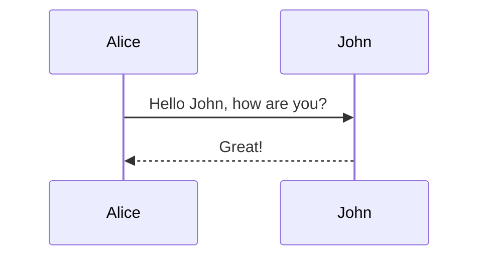

That will be rendered into this:



You can also go with more complex features and diagrams from the [documentation](https://mermaid-js.github.io/mermaid/),
and try it out with the [live editor](https://mermaid.live/).

### SequenceDiagram

<div class="mermaid">
sequenceDiagram
    participant Alice
    participant Bob
    Alice->>John: Hello John, how are you?
    loop Healthcheck
        John->>John: Fight against hypochondria
    end
    Note right of John: Rational thoughts prevail!
    John-->>Alice: Great!
    John->>Bob: How about you?
    Bob-->>John: Jolly good!
</div>

### Flow

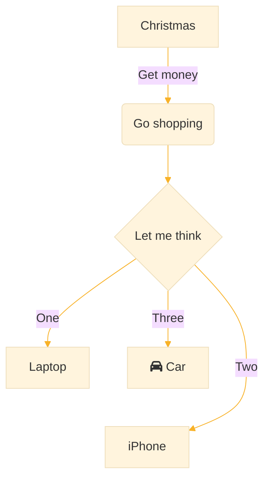

### Class

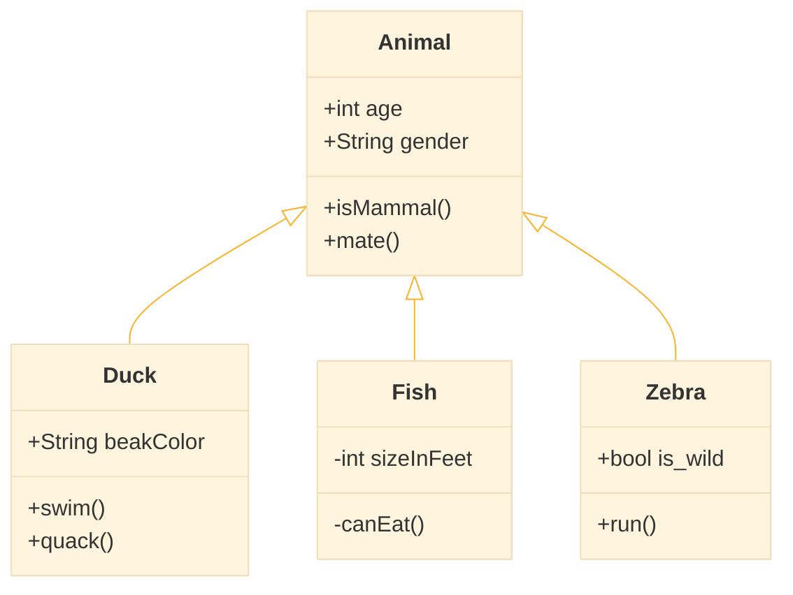

### State

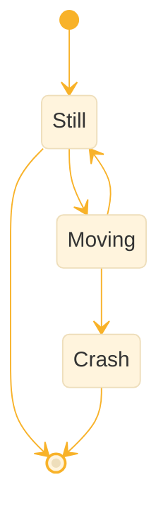

### ER

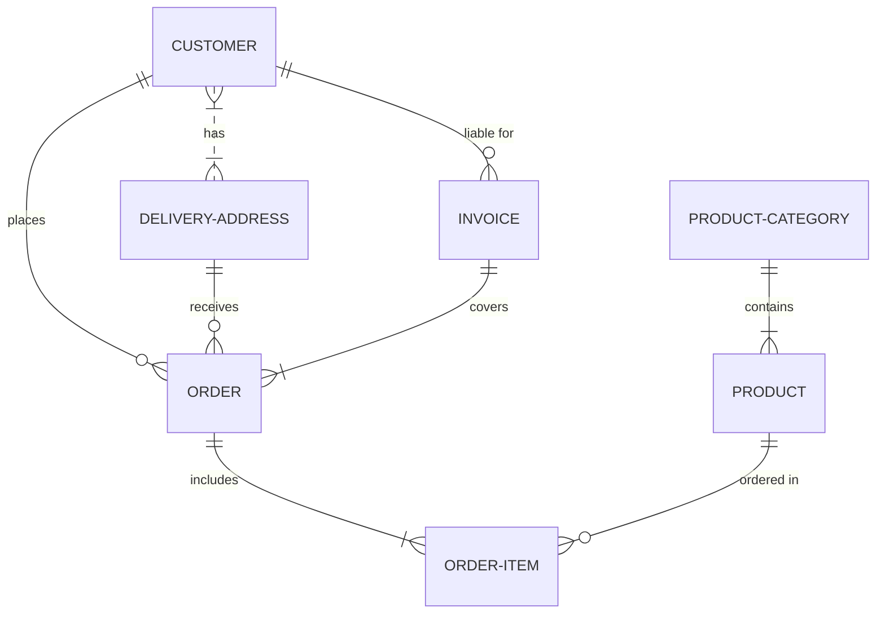

### Gantt

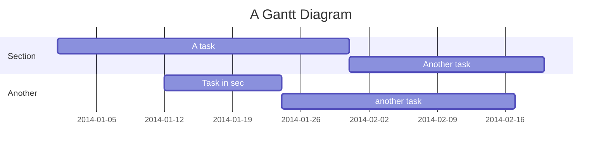

### User Journey

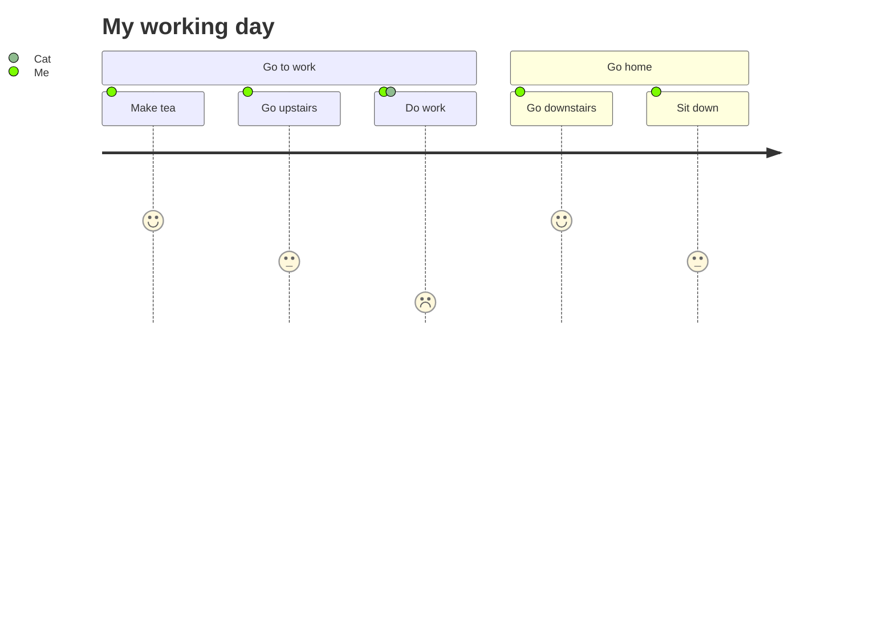

### Git

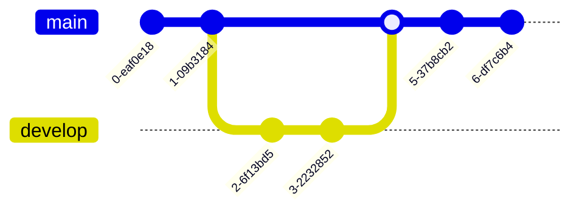

### Pie

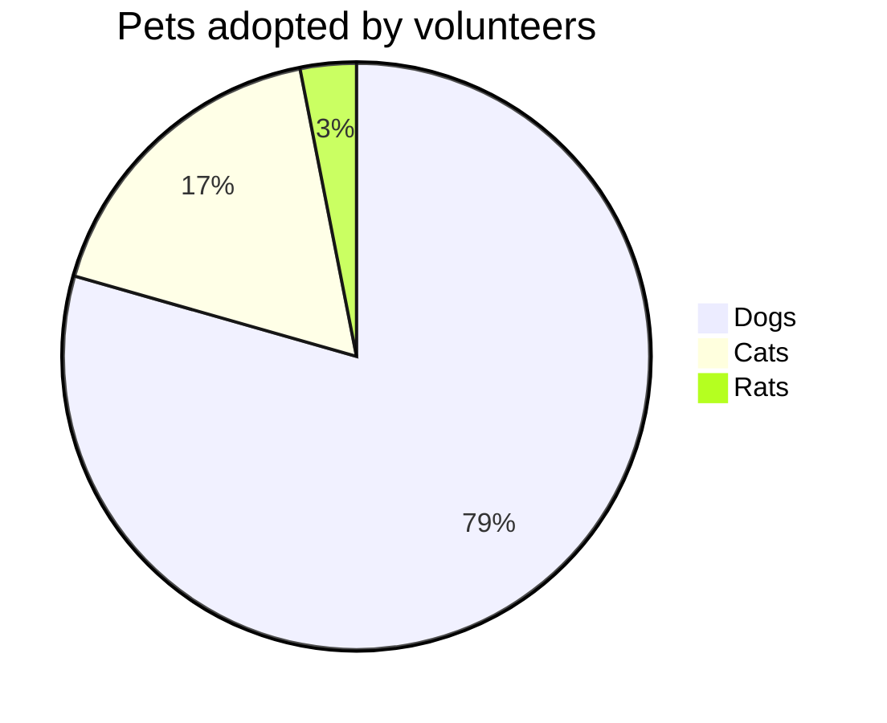

### Mindmap

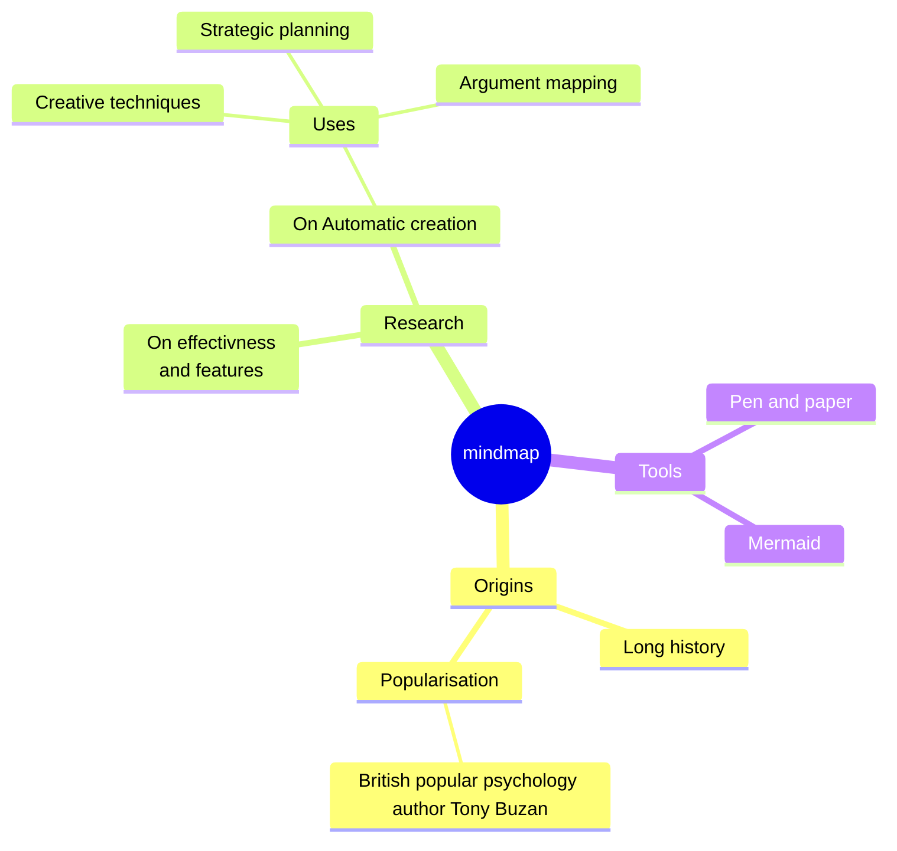

### QuadrantChart

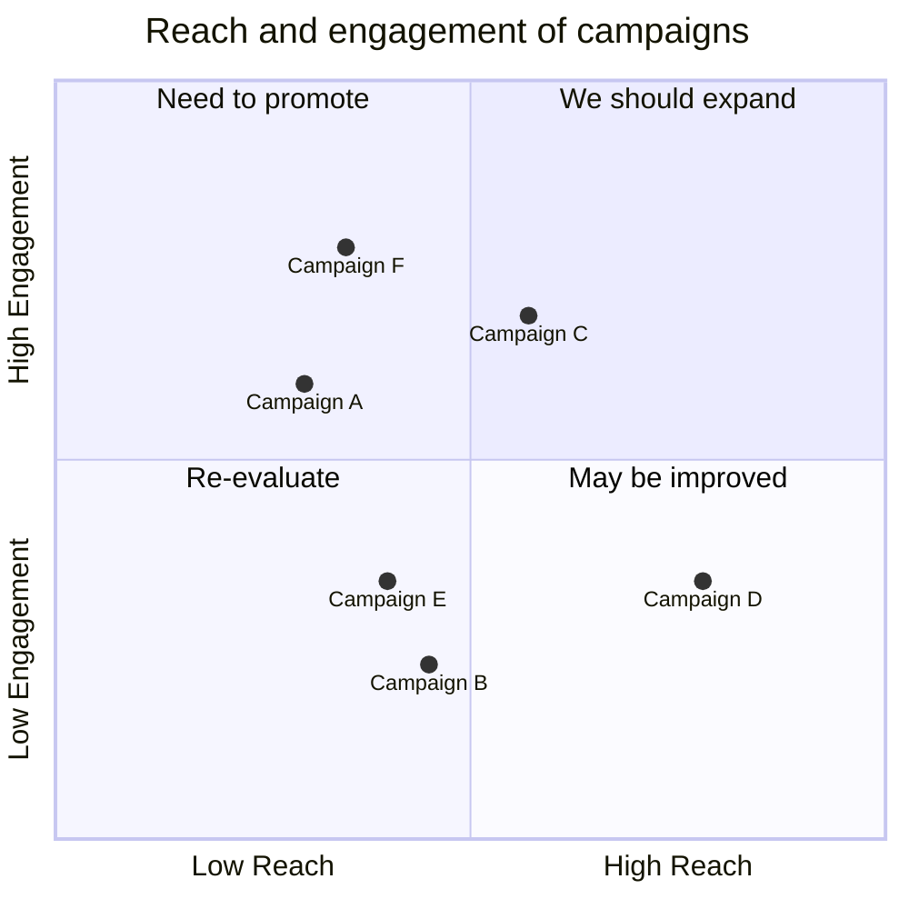

### XYChart

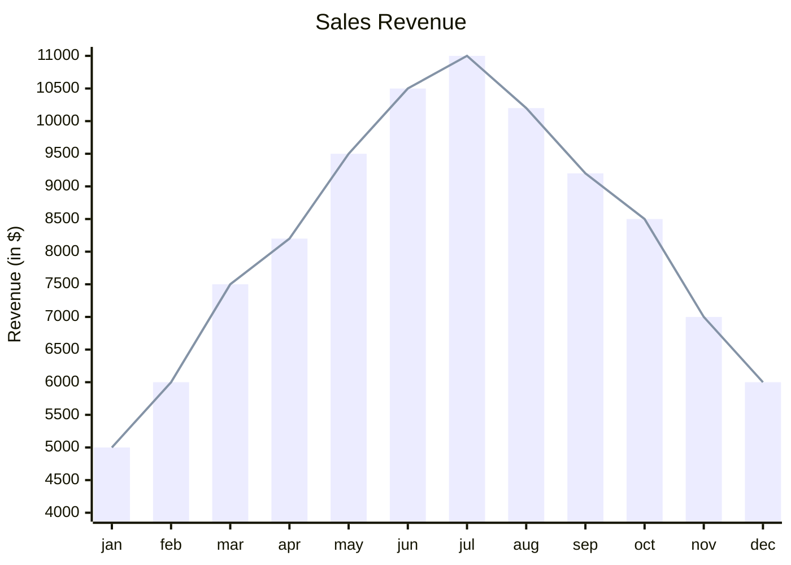


# Feature Images


Hopefully you will find enough information about how to set images in your blog here.
This is an example of a post which includes a feature image specified in the front matter of the post.
The feature image spans the full-width of the page, and is shown with the title on permalink pages:

```yaml
feature-img: "assets/img/feature-img/desk-messy.jpeg"
thumbnail: "assets/img/thumbnails/feature-img/desk-messy.jpeg"
```

You can also use a thumbnail, a smaller version of the same image to improve loading of the page.
The thumbnail will also be used when you share your article on other platform (linkedin, whatsapp, facebook, ...).

>  - And now it is working

You can also add images aligned in your post using the `aligner` include.
Make sure to separate all of the image path from in a string separated with `,`.
It by default look into `assets/img/` so give the path from there, example:










Here you have two images side by side, but you can set more and set the amount per columns
(by specifying the number of columns or let it be automatic using `"auto"`):









it also works with only one images, it is made to display it smaller than normally.
However you can just use the Markdown way of doing it to get the image normal sized and centered.



# Markdown way

# Aligner with only one image







> Suspendisse lectus leo, consectetur in tempor sit amet, placerat quis neque

Etiam luctus porttitor lorem, sed suscipit est rutrum non. Curabitur lobortis nisl a enim congue semper. Aenean commodo ultrices imperdiet. Vestibulum ut justo vel sapien venenatis tincidunt.

$$ \Theta \ne \Gamma $$


